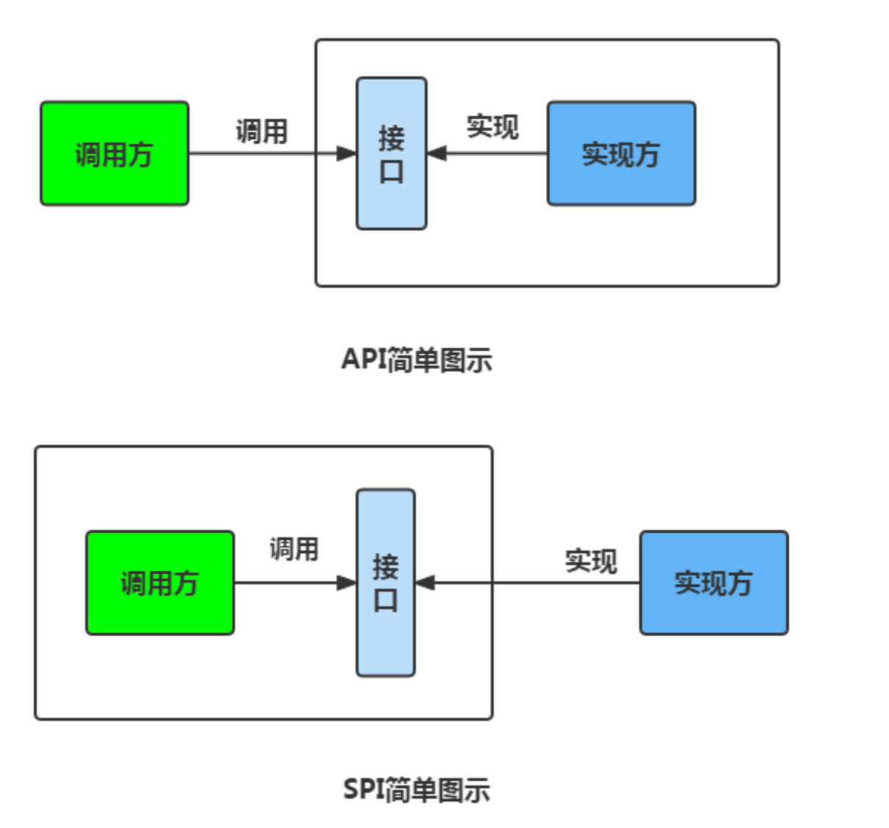

### 这是一个针对SPI机制练习的小demo，看到JavaGuid关于SPI的部分时做的，使用在SPI-Client模块

#### 对spi机制的简单说明：
1. 何谓 SPI?SPI 即 Service Provider Interface ，字面意思就是：“服务提供者的接口”，我的理解是：专门提供给服务提供者或者扩展框架功能的开发者去使用的一个接口。SPI 将服务接口和具体的服务实现分离开来，将服务调用方和服务实现者解耦，能够提升程序的扩展性、可维护性。修改或者替换服务实现并不需要修改调用方。很多框架都使用了 Java 的 SPI 机制，比如：Spring 框架、数据库加载驱动、日志接口、以及 Dubbo 的扩展实现等等 
2. 和api的对比，核心就是接口提供方变为了调用方

3. spi机制能运行依赖一些关键的约定
   - 在 src 目录下新建 META-INF/services 文件夹，然后新建以实现的SPI接口全类名为名的文件，文件内容为SPI 的实现类的包名 + 类名
   
   - ServiceLoader类会去指定的地方查找对应文件

#### 整个过程中涉及三方：
1. 接口定义方：SPI-Interface
2. 接口实现方：SPI-Logback-Service,SPI-Sl4j-Service
3. 接口使用方：SPI-Client

注意点
- 接口实现方的具体实现类必须要提供无参构造方法
- 在idea中必须要把META-INF目录所在的resources目录标记为资源跟目录才能打包成功

#### 在idea中打jar包的步骤
1. 在项目结构中添加要打的包

2. 具体配置

这一步有几个需要注意的点
   - 只选择你需要打包的模块
   - 被打包的模块需要一个主类作为入口类（一个有main方法的类）
   - “来自库的jar文件的配置”的说明
     - 第一个的含义是把模块的class和模块依赖的class打在一起做为一个包
       - 
     - 第二个的含义是模块和模块依赖的class分开打包
       - 
   - 一定要选定到META-INF目录

3. 选择构建
- 
- 

4. 构建产物
- 